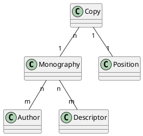

# Minimal model to code

A collection of books has to be made in to a minimal library for a school. There is no digital or paper database.

There is a *librarian* who will manage it.

At the very minimal this Meucci database can be a way for the *librarian* to keep record of the *books owned* by the library. When a *user* need a book she need to find out if it exist in the collection, if it is available, and where to find it (shelf).

Authors can be from any country, culture and time. So their names greatly varies in format (surname, father_name, mother_name, middle_name, and order of them). For simplicity it is recorded as a single string.
