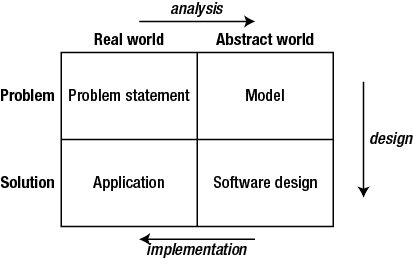

# Meucci Database
The activities to be performed during the Meucci Information System life are show in the picture taken from Clare Churcher's book.

 Since I choose an incremental approach, these do not follow each other, but are reapeated during project life.


## Initial problem statement
The mission of the library is to preserve the books and make them available to **members**.
The public library of a small town. One location only. Chief Librarian and Librarian.
Only books, no Periodicals, no Multimedia content. Many technical and scientific books, some fiction, poetry and classic literature. Some books have many **copies**. It is an open shelf Library.
Catalogue OPAC, Inventory, Classification system, Inventory number.
I will ignore the calendar, roaster, Daily Log.
I express the problem in terms of data to be stored and data to be retrieved.

### Store 1
The **librarian** need to write down all owned **books**.
What the librarian want as an entry form for a book
title | author | classification | publisher | date | position
--|--|--|--|--|--|
Linux pocket guide | Daniel J. Barret | Computer Science, Manual | O'Reilly | 2012 | room 2 shelf 3


### Store 2
A member needs to know whether a given book is owned by the library and whether it is available. Possible search are by **title**, **author**, subject (I need it or the classification is enougth?).

### Store 3
When a citizen want to borrow a book, the librarian need to write down  something like that
citizen | book | date_borrow | date_return
--|--|--|--|
Mario Rossi | Linux pocket guide | 2016-09-06 | 2016-10-04

### Retrieve 2
Every week the librarian need a report of member who are late on returning books and call them or send them a email message.


<!------------------------------------------------------------------------------------>
## Analysis
### Initial Usecase diagram
```plantuml
left to right direction
:Member: as a1
:Librarian: as a2
a1 --(search for Books by title or Author)
a2 --(register a loan)
a2 -- (register a return)
a2 --(call people late for return )
```
### Retrieve 3
When a book is returned, the librarian need to know where to put back the book.
book | room | shelf
--|--|--
Linux pocket guide | 2 | 3
The **position** is made of room, shelf and maybe another number. Is it fized and written on the book?
The position should not be equivalent on classification, beacuse I want the classification to be  faceted. Also, as the collection grow, it can be moved in other rooms. Or in the future we maybe choose to change the position.
### Initial Object Diagram and some links
```plantuml
object "Primo Levi: Author" as o1
object "La chiave a stella: Book" as o2
object "Il sistema periodico: Book" as o3
o1 --> o2
o1 --> o3
```

- Classes, relationship, Cardinality
- repeat until satisfied
- revised use cases
- revised classes
- make names simple, correct, meaningful, consistent.

### Look for useful classes of objects
```plantuml
class Book
class Author
class Publisher
```
A Book can mean a lot of things, meaning a physical object, a work by an author, a volume of a bigger work. Maybe the word monography can be used, in the way of Library Science.
A monography is a published work in a finite number of volumes. So we can tell it apart from a periodical.
### Another Class diagram
```plantuml
left to right direction
class Monography
class Author
class Classifier
' Can also be CDU or UDC or UniversalClass
class InventoryItem
class Publisher
Author -- Monography
Monography -- Classifier
InventoryItem -- Monography : "an instance of"
Monography -- Publisher
note "Classifier is Subject" --Classifier
```
### Store 4
title | author | editor | classification | publisher | pub_date
--|--|--|--|--|--|
Le grandi storie della fantascienza | AAVV | Isaac Asimov | Fiction | RCS | 2006 |

### A monography spit between volumes
```plantuml
left to right direction
class Monography
class Volume
class InventoryItem
InventoryItem -- Volume : "an instance of"
Volume "1" --o "n" Monography
```
This work by C. S. Lewis is made of seven novels. I had a copy divided in three volumes.
title | publisher | pub_date | volume | inventory_number
--|--|--|--|--|
The Chronicles of Narnia | Mondadori | 2000 | 1 | 0058
The Chronicles of Narnia | Mondadori | 2000 | 2 | 0059
The Chronicles of Narnia | Mondadori | 2000 | 3 | 0060

A good Librarian will also put a entry for each novel in the Monography table.
```plantuml
object 1 {
  book_title "The Lion, the Witch and the Wardrobe"
  publisher Mondadori
  pub_date 2000
}
object 2 {
  book_title "The Magician's Nephew"
  publisher Mondadori
  pub_date 2000
}
object A {
  inventory_number 0058
  book_title "The chronicles of Narnia"
  publisher Mondadori
  pub_date 2000
}
1 --A
2 -- A

```
### The class Author extends class Contributor
```plantuml
class Monography
class Author
Monography --Author
Monography --Translator
Monography -- Editor
Author --|> Contributor
Translator --|> Contributor
Editor --|> Contributor
' --|> means  extends  
```

### Attributes
+ lingua in cui é scritto
+ titolo originale
+ data di prima pubblicazione
+ data edizione
Members have a  card and can take at most 3 books for a month.
Le opere potrebbero essere classificate secondo un sistema a faccette (etichette o tag), per disciplina (una o piú), argomento (uno o piú), autori, lingua originale, lingua disponibile, data di pubblicazione, paese di prima pubblicazione, numero di pagine.
Alcune opere sono in piú volumi. Alcune opere formano delle collane.
Gli scaffali hanno un numero progressivo, una stanza, un piano.
```plantuml
title classes wit attributes : class diagram
class Author {
    givenName
    surname
    alias
}
class InventoryItem {
    inventoryNum
    price
    from
}
class Shelf {
  floor
  room
  number
}
```

Maybe I'm making things a bit too complex...
```plantuml
title Complex Usecase diagram
left to right direction
:Member: as a1
:Librarian: as a2
:ChiefLibrarian: as a3
a1 -- (search for books)
a2 -- (manage customers)
a2 -- (manage loans)
a3 -- (manage inventory)
a3 -- (manage Clerks)
a3 -- (manage Calendar)
a3 -- (make reports to city Major)
:Technician: as a4
a4 --(teach how to use system)
a4 --(make system secure enough)
a4 --(maintain software)
a4 --(maintain hardware)
```


<!------------------------------------------------------------------------------------>
## Design phase
- which database model I want? I will go for the old way, Relational Model.
- which software I will use? A database like MySQL.
- Translate the classes into tables.
- maybe adding some new tables for many-many relationships.
- choose a data type for every attribute
- choose the primary keys
- meybe add some attributes to use as external keys (to implement a relationship)

```plantuml
title network sketch: deployment diagram
frame "local network" {
component [Database Server] as 1
component [Ethernet switch] as 2
component [Chief Librarian terminal] as 3
component [Librarian terminal] as 4
component [router] as 6
2--1 : ethernet
2--3 : ethernet
2--4 : ethernet
2--6 : ethernet
}
component [Backup Server] as 7
component [Technician terminal] as 8
component [Citizen terminal] as 9
6 --7 : VPN over the Internet
6 --8 : VPN over the Internet
6 --9 : Internet
```

<!------------------------------------------------------------------------------------>
## Implementation
Implementation: write the actual code. I choose MySQL DB, some PHP logic, web frontend.
### For data definition
Write sql code
~~~
CREATE TABLE ;
~~~
### Data Maintenance
for data entry UI, write some php pages with html forms (also datalist) and some insert statements, some insert in more tables at once.
It s is not only data entry, but **to maintain data**
### For creating reports
bla bla
